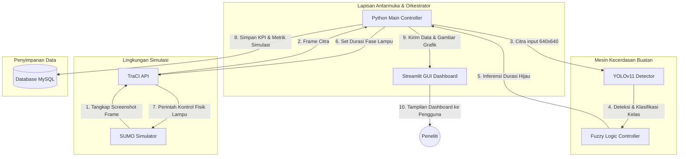

# PANDUAN REVISI DRAF SKRIPSI — BAB III METODE PENELITIAN
**Mohammad Filla Firdaus | NIM. 2215354055 | TRPL PNB**

Dokumen ini berisi draf teks revisi lengkap untuk Bab III proposal skripsi Anda. Teks di bawah ini dirancang dengan gaya bahasa akademis formal yang sesuai dengan standar penulisan skripsi teknik/komputer.

Anda dapat langsung menyalin (copy-paste) bagian-bagian di bawah ini ke dalam dokumen Microsoft Word (.docx) asli milik Anda pada bagian yang bersangkutan.

---

## 1. REVISI DAFTAR ISI (Halaman iv & v)

Ganti baris-baris pada **Daftar Isi** yang mengandung kata *FastAPI*, *Vue.js*, dan *PostgreSQL* menjadi seperti berikut:

* **Sebelumnya (Lama):**
  * `5. Backend (FastAPI) ke Frontend (Vue.js) dan Database ......................... 34`
  * `3.4.1 Arsitektur Sistem (Front-end Vue.js, Backend FastAPI, PostgreSQL)`

* **Sesudahnya (Baru):**
  * `5. Integrasi Antarmuka Streamlit dan Database MySQL ......................... 34`
  * `3.4.1 Arsitektur Sistem (Antarmuka Streamlit, Pengendali Python, MySQL)`

---

## 2. REVISI SUB-BAB 3.2.1 — Kebutuhan Fungsional (Halaman 13)

Pada bagian **Kebutuhan Fungsional**, perbaiki poin-poin penyimpanan data dan visualisasi agar selaras dengan penggunaan MySQL dan Streamlit:

### A. Sub-bab 3.2.1 Poin 6 (Penyimpanan Data dan Model - Halaman 17-18)
* **Teks Lama:**
  > a. Penyimpanan Data Lalu Lintas: Sistem menggunakan database relasional PostgreSQL untuk menyimpan metadata kondisi persimpangan, hasil prediksi jumlah kendaraan, nilai confidence score, serta statistik kinerja lalu lintas yang meliputi panjang antrean (queue length) dan waktu tunggu rata-rata (average waiting time).
* **Teks Baru (Revisi):**
  > a. Penyimpanan Data Lalu Lintas: Sistem menggunakan database relasional **MySQL** untuk menyimpan metadata kondisi persimpangan, hasil prediksi jumlah kendaraan, nilai tingkat kepercayaan (confidence score), serta statistik kinerja lalu lintas yang meliputi panjang antrean (*queue length*) dan waktu tunggu rata-rata (*average waiting time*). Database ini diakses menggunakan pustaka ORM SQLAlchemy dengan driver **PyMySQL** untuk menjamin efisiensi transaksi data selama simulasi berlangsung.

### B. Sub-bab 3.2.1 Poin 7 (Pelaporan dan Analisis Hasil - Halaman 18)
* **Teks Lama:**
  > ...Seluruh data statistik dan visualisasi hasil deteksi ini disajikan secara reaktif melalui dashboard pemantauan berbasis FastAPI dan Vue.js, yang juga terhubung dengan basis data PostgreSQL sebagai media penyimpanan arsip untuk kebutuhan analisis...
* **Teks Baru (Revisi):**
  > ...Seluruh data statistik dan visualisasi hasil deteksi ini disajikan secara reaktif dan interaktif melalui dashboard pemantauan berbasis **Streamlit**, yang terhubung secara langsung dengan mesin kontroler Python dan basis data **MySQL** sebagai media penyimpanan arsip untuk kebutuhan analisis perbandingan efektivitas sistem di akhir penelitian.

---

## 3. REVISI TABEL USE CASE & SKENARIO PENGUJIAN (Halaman 25, 38, 40)

Pada tabel-tabel spesifikasi use case dan pengujian sistem, sesuaikan prakondisi dan langkah pengujian yang semula merujuk pada server FastAPI dan dashboard Vue.js menjadi aplikasi Streamlit dan database MySQL.

### A. Tabel 3.4 — Inisialisasi Koneksi TraCI (Halaman 25)
* **Prakondisi Lama:**
  > Skenario `.sumocfg` siap dan server FastAPI aktif.
* **Prakondisi Baru (Revisi):**
  > Skenario `.sumocfg` siap dan aplikasi **Streamlit** aktif.

### B. Tabel 3.8 — Pengujian Sistem (Halaman 38)
* **Baris Inisialisasi Koneksi TraCI:**
  * **Langkah Pengujian Lama:**
    > 1. Klik tombol "Start Simulation" pada dashboard Vue.js.
  * **Langkah Pengujian Baru (Revisi):**
    > 1. Klik tombol "Start Simulation" atau jalankan kendali simulasi pada antarmuka **Streamlit**.
  * **Hasil yang Diharapkan Lama:**
    > Sistem berhasil membuka simulator SUMO dan status koneksi TraCI menjadi "Connected".
  * **Hasil yang Diharapkan Baru (Revisi):**
    > Sistem berhasil memulai modul Python TraCI untuk memicu pembukaan simulator SUMO (baik GUI maupun CLI) dan menampilkan status koneksi menjadi "Connected" pada antarmuka **Streamlit**.

* **Baris Monitoring Dashboard:**
  * **Prakondisi Lama:**
    > Simulasi sedang berjalan dan data tersimpan di PostgreSQL.
  * **Prakondisi Baru (Revisi):**
    > Simulasi sedang berjalan dan data tersimpan di **MySQL**.
  * **Langkah Pengujian Lama:**
    > 1. Buka halaman "Statistics" pada dashboard Vue.js.
  * **Langkah Pengujian Baru (Revisi):**
    > 1. Buka halaman panel visualisasi utama/Statistik pada antarmuka **Streamlit**.

* **Baris Evaluasi & Laporan:**
  * **Hasil yang Diharapkan Lama:**
    > File laporan berhasil diunduh dan memuat ringkasan perbandingan sistem adaptif vs konvensional.
  * **Hasil yang Diharapkan Baru (Revisi):**
    > File laporan ringkasan perbandingan sistem adaptif vs konvensional berhasil disimpan (dalam format gambar grafik `.png` atau data `.csv`) pada direktori output yang terhubung dengan sistem pelaporan **Streamlit**.

---

## 4. REVISI UTAMA SUB-BAB 3.4 — Arsitektur Sistem dan Desain Model Sistem Cerdas (Halaman 31-34)

Ganti seluruh isi sub-bab 3.4.1 (Arsitektur Sistem) mulai dari halaman 31 sampai halaman 34 dengan draf teks akademis di bawah ini.

### 3.4.1 Arsitektur Sistem

Pembangunan simulasi sistem pengendalian lampu lalu lintas berbasis YOLOv11 dan Logika Fuzzy yang diusulkan dirancang menggunakan arsitektur modular yang menyatukan komponen antarmuka pengguna, mesin kecerdasan buatan, database, dan simulator lalu lintas. Secara struktural, diagram arsitektur sistem digambarkan pada Gambar 3.3 di bawah ini:

*Gambar 3. 3 Diagram Arsitektur Sistem*

Berdasarkan struktur arsitektur pada Gambar 3.3, sistem dibagi menjadi 4 (empat) lapisan utama sebagai berikut:

1. **Antarmuka Pengguna dan Orkestrator (Streamlit GUI & Python Main Controller)**
   Lapisan ini dikembangkan menggunakan kerangka kerja (*framework*) **Streamlit** berbasis bahasa pemrograman Python. Pemilihan Streamlit didasarkan pada kemampuannya untuk mengintegrasikan logika pemrograman backend dengan komponen visual frontend secara langsung dan *real-time* tanpa memerlukan arsitektur REST API yang terpisah seperti pada Vue.js dan FastAPI. Pemilihan ini menyederhanakan siklus pengembangan perangkat lunak. Lapisan ini bertindak sebagai orkestrator utama sistem yang mengatur inisialisasi simulasi, memproses argumen baris perintah (*command line interface*), memicu inferensi model kecerdasan buatan, mengoordinasikan jembatan komunikasi TraCI, serta menyajikan visualisasi data statistik lalu lintas secara interaktif (seperti grafik panjang antrean dan waktu tunggu rata-rata).

2. **Mesin Kecerdasan Buatan (AI Engine - YOLOv11 & Fuzzy Logic)**
   Komponen AI Engine bertindak sebagai otak dari sistem pengendalian adaptif ini. Komponen ini memiliki dua subsistem utama:
   * **YOLOv11 Detector:** Berfungsi untuk menerima masukan berupa frame citra dari simulator (melalui ROI atau *Region of Interest* lajur persimpangan), mendeteksi objek kendaraan secara *real-time*, dan mengklasifikasikannya ke dalam kelas *motor*, *mobil*, *bus*, dan *truk*.
   * **Fuzzy Logic Controller:** Menggunakan pustaka `scikit-fuzzy` untuk menerima input jumlah kendaraan terdeteksi (yang telah dikonversi menjadi bobot kepadatan lalu lintas), melakukan proses fuzzifikasi, mengevaluasi aturan berbasis aturan keputusan (*rule base*), dan melakukan defuzzifikasi dengan metode *centroid* untuk menentukan durasi lampu hijau optimal berkisar antara 10 hingga 60 detik.

3. **Lingkungan Simulasi Lalu Lintas (SUMO & TraCI API)**
   Komponen ini menggunakan perangkat lunak **SUMO (Simulation of Urban MObility)** untuk memodelkan geometri persimpangan jalan perkotaan (perempatan atau pertigaan), rute arus kendaraan, dan siklus fase lampu lalu lintas asli. Komunikasi data dua arah antara mesin pengendali Python dengan simulator SUMO dijembatani oleh **TraCI (Traffic Control Interface)** API. Melalui TraCI, sistem dapat mengambil cuplikan gambar (*screenshot frame*) area persimpangan, membaca status antrean lajur, serta mengirimkan perintah penyesuaian durasi hijau (*phase duration modification*) ke modul lampu lalu lintas di SUMO secara dinamis.

4. **Penyimpanan Data (Data Storage - MySQL)**
   Lapisan penyimpanan data diimplementasikan menggunakan sistem manajemen basis data relasional **MySQL**. Pencatatan data dari memori program ke MySQL dikelola melalui ORM (*Object-Relational Mapping*) **SQLAlchemy** dan **Alembic** untuk migrasi skema database. Lapisan ini menyimpan riwayat komparasi performa lalu lintas secara permanen, meliputi:
   * Metadata ringkasan per *simulation run* (KPI seperti rata-rata waktu tunggu, rata-rata panjang antrean, *throughput*, *fairness index*, dan durasi total simulasi).
   * Metrik per langkah simulasi (*step-by-step metrics*) yang mencatat kepadatan per detik lajur untuk dianalisis pasca-simulasi.
   * Catatan kejadian perubahan lampu (*phase events*) seperti inisiasi lampu hijau, kuning, all-red, serta perpanjangan (*green extension*) atau pemotongan waktu hijau.

---

### Alur Komunikasi Antar-Komponen

Alur komunikasi data dalam sistem pengendalian adaptif ini bekerja secara siklis (*closed-loop feedback*) dalam rentang langkah waktu simulasi (*simulation time-step*). Mekanisme interaksi data tersebut dijabarkan melalui langkah-langkah berikut:

1. **Akuisisi Citra dan Status Simulasi (SUMO ke Controller)**
   Simulator SUMO menjalankan simulasi lalu lintas langkah demi langkah. Pada setiap interval keputusan, pengendali utama Python mengirimkan perintah melalui protokol TraCI untuk menangkap frame citra visual area persimpangan (resolusi minimal 640x640 piksel) serta menarik data statistik lajur (panjang antrean aktual dalam meter).

2. **Deteksi Kendaraan (Controller ke YOLOv11)**
   Frame citra visual dikirimkan ke modul deteksi YOLOv11. YOLOv11 melakukan segmentasi spasial pada area *Region of Interest* (ROI) lajur utara, selatan, timur, dan barat, lalu mendeteksi koordinat *bounding box* serta kelas jenis kendaraan. Hasil keluaran berupa hitungan per kelas dikonversi menjadi beban lalu lintas berbobot menggunakan rumus ekuivalensi (Motor = 1.0, Mobil = 1.5, Bus = 2.5, Truk = 3.0).

3. **Inferensi Durasi Hijau (YOLOv11 & Beban Kendaraan ke Fuzzy Logic)**
   Nilai bobot kepadatan kendaraan per arah jalan dimasukkan sebagai variabel masukan (*input antecedent*) ke dalam modul logika fuzzy. Mesin inferensi melakukan kalkulasi derajat keanggotaan (Sedikit, Sedang, Padat), mengevaluasi aturan keputusan (IF-THEN), dan menghasilkan durasi hijau optimal (*output consequent*) berupa nilai tegas (*crisp value*) dalam satuan detik.

4. **Eksekusi Kontrol Lampu (Fuzzy ke SUMO)**
   Hasil durasi hijau adaptif dari modul fuzzy dikirimkan kembali oleh pengendali Python ke simulator SUMO menggunakan perintah `traci.trafficlight.setPhaseDuration()` untuk memperbarui durasi fase lampu lalu lintas di persimpangan secara dinamis.

5. **Penyimpanan Historis dan Visualisasi (Controller ke MySQL & Streamlit)**
   Secara paralel, seluruh metrik performa (kepadatan lajur, waktu tunggu kendaraan, latensi pemrosesan YOLO dan fuzzy) dikirimkan ke database **MySQL** untuk disimpan dalam tabel relasional. Pada saat yang sama, data tersebut disalurkan secara *real-time* ke antarmuka dashboard **Streamlit** untuk memperbarui grafik kinerja visual yang dapat dipantau langsung oleh pengguna.

---

## 5. REVISI SUB-BAB 3.5.3 — Pengujian Kinerja Sistem (Halaman 40)

Pada Tabel 3.11 (atau Tabel 3.9 tergantung penomoran tabel di proposal Anda) yang berjudul **Pengujian Kinerja Sistem**, sesuaikan kolom metodologi/alat pengukur:

* **Baris Penggunaan Memori (RAM):**
  * **Langkah Pengujian Lama:**
    > Menjalankan simulasi penuh (FastAPI, Vue, SUMO, YOLOv11, Fuzzy).
  * **Langkah Pengujian Baru (Revisi):**
    > Menjalankan simulasi penuh (**Streamlit**, SUMO, YOLOv11, Fuzzy).

* **Baris Latensi Keputusan Fuzzy:**
  * **Keterangan Lama:**
    > Mengukur waktu pengolahan logika Fuzzy hingga menghasilkan durasi lampu.
  * **Keterangan Baru (Revisi):**
    > Mengukur waktu pemrosesan modul logika Fuzzy (dari pembacaan data kendaraan di main controller hingga menghasilkan nilai durasi detik di dashboard **Streamlit**).
